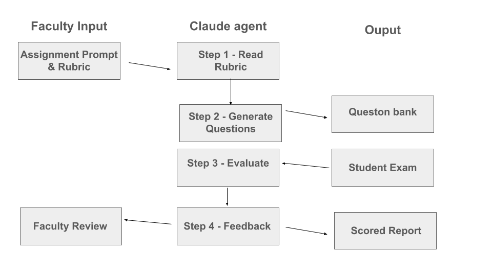
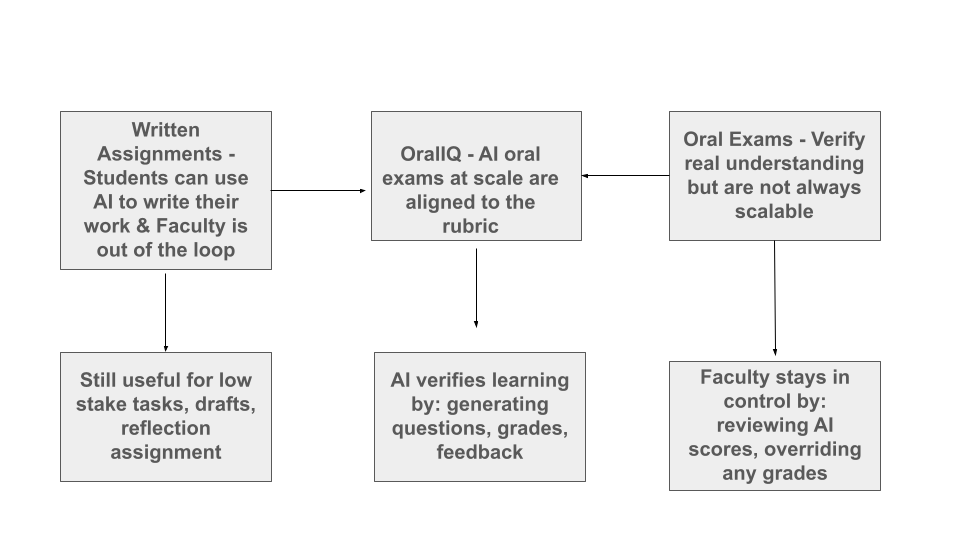

# OralIQ — AI-Powered Oral Assessment Platform

> *Verifying student understanding at scale in the age of generative AI.*

---




---

## Why This Project Matters

Written assignments can no longer reliably verify student understanding. With tools like ChatGPT, students can generate polished essays in seconds — making it increasingly difficult for faculty to know whether learning has actually occurred.

Oral exams are the most reliable way to verify genuine understanding. You cannot fake a spontaneous, reasoned spoken answer. But oral exams do not scale — a professor cannot conduct 30-minute one-on-one interviews with 120 students every semester.

OralIQ bridges this gap. It is an agentic AI application that allows faculty to administer AI-supported oral assessments aligned to their own assignments and grading rubrics — efficiently, consistently, and at scale.

---

## Author List

| Name | GitHub |
|------|--------|
| [Joel Emanuel](https://github.com/JoelEmanuel) | MSBA, Class of 2026 |
| [Louisa Ferrel](https://github.com/louisaferrel) | MSBA, Class of 2026 |
| [Regan Macak](https://github.com/ReganMacak) | MSBA, Class of 2026 |
| [Ethiana Hacsh](https://github.com/ehacsh03) | MSBA, Class of 2026 |

---

## Project Scope

OralIQ is a discipline-agnostic oral assessment web application designed specifically for business school courses including Finance, Economics, Marketing, and Organizational Behavior.

**In scope:**
- Faculty upload of assignment prompts and grading rubrics
- AI generation of oral exam questions aligned to the rubric
- Student-facing exam interface with audio recording and typed responses
- AI grading and structured feedback per question
- Practice mode with parallel question sets
- Downloadable reports per student session

**Out of scope (future work):**
- Real-time speech transcription via Whisper API (prototype uses typed responses)
- Live video proctoring
- LMS integration (Canvas, Blackboard)
- Multi-language support

---

## Project Details

### The Core Problem

The business school faces a specific challenge: team assignments and AI tools make it easy for students to submit polished work that does not reflect individual understanding. Faculty need a scalable mechanism to verify that each student — not just the group — genuinely understands the material they submitted.

Oral exams are the gold standard for this verification, but they are time-intensive. A faculty member teaching 120 students cannot conduct individual oral exams without significant time cost. OralIQ addresses this directly.

---

### Agentic Design Architecture

OralIQ is built around an agentic AI workflow — meaning Claude does not simply answer a single prompt. It autonomously chains multiple reasoning steps across every exam session.

Each step is a distinct Claude API call with a specialized system prompt. This is agentic because:

1. Claude reasons about the rubric before generating questions — it does not produce generic questions
2. Each student response is evaluated in context of the original rubric criteria
3. Claude takes on different personas (Skeptical Client, Supervisor, Examiner) to simulate realistic business scenarios
4. The system chains these outputs autonomously — faculty do not intervene between steps

---

### Key Features

#### 1. Faculty Portal
Faculty upload their assignment prompt and grading rubric (paste or file upload). Claude analyzes the rubric and generates 5–15 oral exam questions mapped to specific grading criteria. Faculty can edit, delete, or regenerate individual questions before publishing the exam.

#### 2. Role-Based Questioning
Questions are delivered with assigned AI personas — Skeptical Client, Supervisor, Peer Reviewer, Board Member. This simulates real business interactions and tests whether students can apply knowledge in context, not just recite it.

#### 3. Student Exam Interface
Students access a timed, sequential exam. Each question is presented one at a time with no ability to return. Students record audio responses and type their answer. Time limits (configurable per assignment) prevent AI tool use during the exam.

#### 4. AI Grading and Feedback
After submission, Claude grades each response against the rubric criteria with scores out of 10 and structured feedback across four dimensions: content accuracy and depth, communication clarity, specific strengths, and specific areas for improvement.

#### 5. Practice Mode
A separate practice environment generates parallel questions — same rubric alignment, different specific questions — so students can prepare without seeing real exam questions. Formative feedback motivates learning.

#### 6. Report Generation
Each completed exam generates a downloadable report with all questions, student answers, scores, and feedback. Faculty maintain full control over final grades.

---

### Technical Stack

| Layer | Technology | Purpose |
|-------|-----------|---------|
| Frontend | HTML, CSS, JavaScript | Single-file web app, no build step required |
| AI Engine | Anthropic Claude API | Question generation, grading, feedback |
| Audio Capture | Browser MediaRecorder API | In-browser microphone recording |
| Storage | Browser localStorage | Session and question persistence |
| Hosting | GitHub Pages | Free, instant public deployment |

---

### How the AI Prompting Works

The system uses three distinct Claude API calls, each with a specialized system prompt:

**Prompt 1 — Question Generation**
```
System: "You are an expert [subject] professor designing rigorous oral exam
questions that test genuine understanding, not memorization."

User: "Generate [n] oral exam questions aligned to this rubric: [rubric].
Assignment context: [prompt]. Return as JSON array with question, criteria,
role, and difficulty fields."
```

**Prompt 2 — Response Grading**
```
System: "You are an expert business school professor grading oral exam
responses. Be fair, specific, and constructive."

User: "Grade these responses against this rubric: [rubric].
[Each question + student answer]. Return JSON with score, contentFeedback,
communicationFeedback, strengths, improvements per question."
```

**Prompt 3 — Practice Feedback**
```
System: "You are a supportive business school professor giving practice feedback."

User: "Question: [q]. Student answer: [a]. Give feedback on what they got
right, what is missing, and one exam tip. Under 200 words."
```

---

## What's Next

### Near-Term Development
- **Whisper API integration** — real-time audio transcription so students can respond purely orally without typing
- **ElevenLabs voice output** — AI voice reads questions aloud, enabling fully audio-based exams
- **Email delivery** — unique exam links sent to each student automatically
- **Supabase backend** — persistent cloud storage replacing localStorage, enabling multi-device faculty access

### Medium-Term
- **LMS integration** — embed OralIQ directly into Canvas or Blackboard gradebooks
- **Video proctoring layer** — optional webcam recording for academic integrity
- **Team oral exams** — group sessions where multiple students answer collaboratively
- **Analytics dashboard** — class-wide performance trends by question and rubric criterion

### Long-Term Vision
- **Multi-institution deployment** — SaaS model for business schools
- **Discipline expansion** — law school Socratic method, medical school clinical reasoning
- **Adaptive questioning** — follow-up questions generated dynamically based on student responses

---

## Responsible AI Considerations

OralIQ is designed with academic integrity and student wellbeing as primary constraints.

### Bias and Fairness
AI grading models may favor certain communication styles, vocabulary, or sentence structures. Students from non-English-speaking backgrounds or with different rhetorical traditions may be systematically disadvantaged. **Mitigation:** AI scores are presented as recommendations, not final grades. Faculty retain full grading authority.

### Accessibility
Voice-based assessment may disadvantage students with speech impediments, social anxiety, or disabilities affecting verbal communication. **Mitigation:** The platform supports typed responses as a full alternative to audio. Accommodations remain at faculty discretion.

### Over-Reliance on AI Assessment
Faculty may be tempted to accept AI scores without review, reducing the human judgment that is central to fair assessment. **Mitigation:** The system explicitly labels all scores as "AI-Generated Score" and frames faculty review as a required step, not optional.

### Student Data Privacy
Student responses, audio recordings, and performance data are sensitive. **Mitigation:** In the current prototype, all data is stored locally in the browser and never transmitted to a server beyond the Claude API call. Production deployment would require IRB review, FERPA compliance, and explicit data retention policies.

### Motivating Learning, Not Gaming
Students may attempt to game the practice mode to infer real exam questions. **Mitigation:** Practice questions are generated fresh each session using a different prompt path than real exam questions, making reverse-engineering impractical.

### Transparency
Students should know they are being assessed by an AI system. **Mitigation:** The platform clearly identifies itself as AI-powered on all student-facing screens.

---

## Research Foundation

### Research Paper 1
Gaballo, V. (2024). Revolutionizing language teaching: AI in oral language assessment. *Innovation in Language Learning*, 17th Edition.
https://doi.org/10.26352/IY07_2384-9509

**Relevance:** Demonstrates AI-powered oral assessment in a real classroom of 145 students at the University of Padua, directly validating OralIQ's core approach and scalability claims.

### Research Paper 2
Eachempati, P., Komattil, R., & Arakala, A. (2025). Should oral examination be reimagined in the era of AI? *Advances in Physiology Education*, 49(1), 208–209.
https://doi.org/10.1152/advan.00191.2024

**Relevance:** Argues that oral exams are the most reliable mechanism for verifying genuine student understanding in the age of AI-generated written work — the exact problem OralIQ is designed to solve.

### Research Paper 3
Kostopoulos, G., Gkamas, V., Rigou, M., & Kotsiantis, S. (2025). Agentic AI in education: State of the art and future directions. *IEEE Access*.
https://doi.org/10.1109/ACCESS.2025.3620473

**Relevance:** Provides the theoretical foundation for OralIQ's agentic design — defining autonomous, multi-step AI reasoning and its established application to educational assessment contexts.

### Additional References
- Anthropic. (2024). *Claude API Documentation.* https://docs.anthropic.com
- Kasneci, E., et al. (2023). ChatGPT for good? On opportunities and challenges of large language models for education. *Learning and Individual Differences*, 103, 102274.

---

## Project Board

Our team used a GitHub Project kanban board throughout development to track tasks, blockers, and future ideas.

**[→ View our Project Board](https://github.com/users/ehacsh03/projects/2)**

| Done | In Progress | To Do  |
|---------|---------------|-------------------|
| Project scoping | README writing | Whisper API integration |
| App architecture design | Code demo notebook | ElevenLabs voice output |
| Claude API integration | Presentation prep | Supabase backend |
| Faculty portal UI | Research paper review | LMS integration |
| Question generation | | Video proctoring |
| Student exam interface | | Adaptive follow-up questions |
| AI grading + feedback | | Multi-institution SaaS |
| Practice mode | | |
| Report download | | |
| GitHub Pages deployment | | |

---

## Live Demo

**→ [Launch OralIQ](https://ehacsh03.github.io/artificial-intelligience-agent-final-project-team6/oral_assessment_app.html)**

To run locally: download `oral_assessment_app.html` and open in any modern browser. Enter your Anthropic API key when prompted.

---

## Code Demo

See `demo_notebook.ipynb` for a minimal, runnable demonstration of the core AI concept — Claude generating oral exam questions from a rubric in under 20 lines of Python.

---

*Built for AI · College of William and Mary · Spring 2025*
